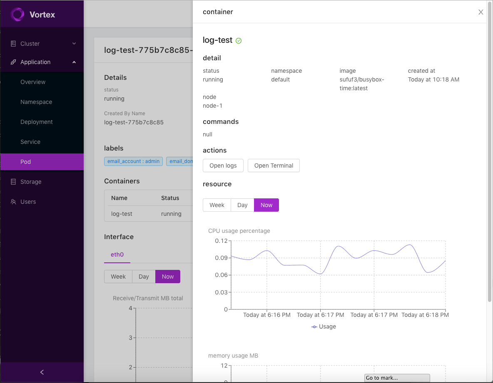

Vortex [](https://travis-ci.org/linkernetworks/vortex) [](https://goreportcard.com/report/github.com/linkernetworks/vortex) [](https://codecov.io/gh/linkernetworks/vortex) [](https://hub.docker.com/r/sdnvortex/vortex/)
===

# Vortex server



## Frontend

- [Portal](https://github.com/linkernetworks/vortex-portal)

## Backend service

- MongoDB
- InfluxDB
- Prometheus
- [Metrics Server](https://github.com/kubernetes-incubator/metrics-server)
- [Network Controller](https://github.com/linkernetworks/network-controller): Use Open vSwitch as a second bridge for underlay networking

## Deploy to bare metal servers (Using helm)

```shell
$ make apps.init-helm

# configure production yaml 
$ vim deploy/helm/config/production.yaml

$ make apps.launch-prod
```

## Upgrade

```shell
$ apps.upgrade-prod
```

## Teardown all system

```shell
$ make apps.teardown-prod
```
